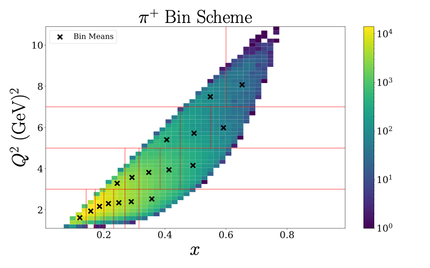
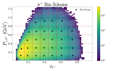
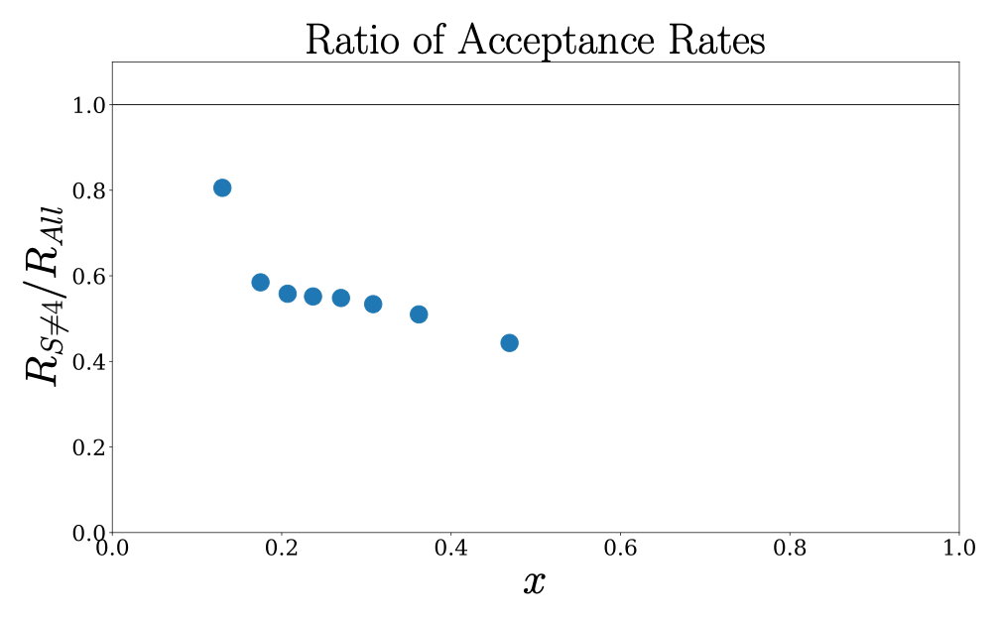
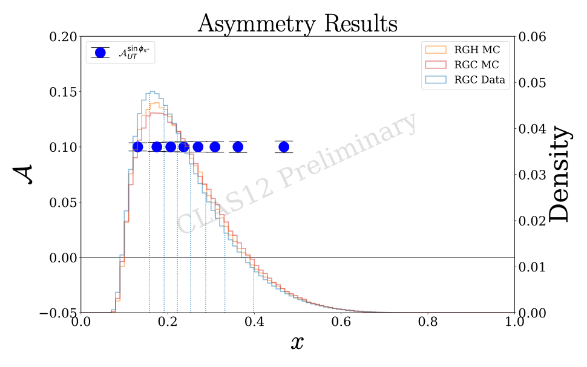

# RGH Projections

This is a storage repository for yamls and scripts used to create the RGH $\delta A_{UT}$ uncertainty projections.

# Prerequisites
* Assumedly, you are working on ifarm and can use slurm to submit jobs
* [`clasdis`](https://github.com/JeffersonLab/clasdis)
* [`gemc`](https://github.com/gemc)
* [`clas12 container forge analysis`](https://pages.jlab.org/hallb/clas12/container-forge/)
* [`rgh_simulation`](https://github.com/mfmceneaney/rgh_simulation.git)
* [`clas12-Analysis`](https://github.com/mfmceneaney/CLAS12-Analysis.git)
* [`saga`](https://github.com/mfmceneaney/saga.git)

From the prerequisites above you should check for system installations of the following on ifarm:
* `clasdis`
* `gemc`
* `recon-util` (from clas12 container forge)

If you do not have an available system installation of `clasdis`,
then install from source and set the path in your `env.txt` file discussed in the next section.

You will also need to install `rgh_simulation` from source and set the path in your `env.txt` file discussed in the next section.

Otherwise install images with either singularity or apptainer.  Note that you may need to set
the cache and tmp directories for these to some directory capable of housing large files.
For example, on the Duke Compute cluster add the following to your startup script.
```bash
# Set container cache and tmp directory to cwork
export CWORK_DIR=/cwork/$USER/
export APPTAINER_CACHEDIR=$CWORK_DIR
export APPTAINER_TMPDIR=$CWORK_DIR
export SINGULARITY_CACHEDIR=$CWORK_DIR
export SINGULARITY_TMPDIR=$CWORK_DIR
```

Here we will use apptainer to install the necessary images.  You will need to set the path to each image in `env.txt`.

Install `gemc` by first pulling the image in a sandbox since you will be installing files within the container.
```bash
apptainer build --sandbox gemc_dev-almalinux94/ docker://jeffersonlab/gemc:dev-almalinux94
```
Then start the container shell:
```bash
apptainer shell gemc_dev-almalinux94/
```
And inside the shell install gemc and check the intallation:
```bash
/cvmfs/oasis.opensciencegrid.org/jlab/geant4/install/install_gemc 5.11
module use /cvmfs/oasis.opensciencegrid.org/jlab/geant4/modules
module load gemc/5.11
gemc --version
```

Install `clas12 container forge analysis`:
```bash
apptainer pull docker://codecr.jlab.org/hallb/clas12/container-forge/analysis:latest
```

Install `clas12-analysis`:
```bash
apptainer pull clas12-analysis.sif oras://ghcr.io/mfmceneaney/clas12-analysis:latest
```

Install `saga`:
```bash
apptainer pull saga.sif oras://ghcr.io/mfmceneaney/saga:latest
```

For running the python scripts in [pyscripts](pyscripts),
you will need the saga python modules.  Create a python virtual environment,
then clone the repository and install saga.
```bash
python3 -m venv venv
source venv/bin/activate
git clone https://github.com/mfmceneaney/saga.git
cd saga
pip install -e .
```

# Installation

Begin by cloning the repository:
```bash
git clone https://github.com/mfmceneaney/rgh_projections.git
```

Update the paths and commands used in the environment script&mdash;[bin/env.sh](bin/env.sh) or [bin/env.csh](bin/env.csh)&mdash;by creating a file env.txt in the root of this repository.
In this file you will need to manually set variables used in the environment script depending on your local installation paths and the paths for existing data and MC samples you wish to use:
`RGH_PROJECTIONS_VOL_DIR`, `CLASDIS_HOME`, `RGH_SIM_HOME`,`RGH_*_IMG`, `RG?_MC_DIR*`, etc.
Yaml paths will be set based on the paths given in the environment script.

After configuring your environment file, source the environment and run the setup script.
```bash
source bin/env.sh
./bin/setup.sh
```

Then add the following to your (bash) startup script:
```bash
# Set up RGH projections https://github.com/mfmceneaney/rgh_projections.git
pushd /path/to/rgh_projections >> /dev/null
source bin/env.sh
popd >> /dev/null
```

# Overview

First you must produce RGH simulation HIPO files using the directories in `jobs/rgh_simulation/`.
To submit the simulation jobs, cd into the relevant directory and run:
```bash
touch jobs.txt
sbatch clasdis_submit.sh >> jobs.txt
```
Once this job has finished, run:
```bash
touch jobs.txt
./setup.sh >> jobs.txt
```

Then, you have to produce channel-specific event-level ROOT files using the directories in `jobs/c12analysis/`.
Make sure to update the paths to existing simulation and data directories for, e.g. RGA or RGC, in your environment script.
To submit these jobs, cd into the relevant directory and run:
```bash
touch jobs.txt
./setup.sh >> jobs.txt
```

Configure yamls for jobs running [`saga`](https://github.com/mfmceneaney/saga.git) by running `$RGH_PROJECTIONS_HOME/bin/setup.sh`.

Run kinematics jobs by going into each directory and manually submitting:
```bash
for file in jobs/saga/test_getBinKinematics*; do
    echo $file
    cd $file
    touch jobs.txt
    sbatch $PWD/submit.sh >> jobs.txt
    cd -
    echo
done
```
Then, run injection studies using the `pyscripts/orchestrate*.py` files.

Finally, aggregate results from injection studies, rescale uncertainty projections, and plot kinematics and bin schemes with the remaining scripts in `pyscripts`.

# What you can do

Here are some examples of the plots you can produce with the python scripts.

You can plot your bin schemes with average kinematics marked for each bin:




Or plot ratios of, e.g. acceptance ratios between different detector configurations, for example excluding particles from sector 4 or not. 



And, most importantly, you can plot rescaled uncertainty projections and show the relevant kinematics distributions in the background.



#

Contact: matthew.mceneaney@duke.edu
